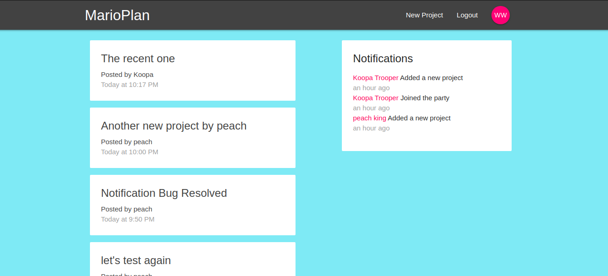

# Mario Plan - React Full Stack Project

### On Computer Screen

### link : https://developer-junaid-marioplan.web.app/

### _A Website built using ReactJs, Redux, Firebase Firestore. You can post projects and view other person's projects ._

## Run Locally

- Run this command `git clone https://github.com/developer-junaid/Mario-Plan.git`
- You are now in the dev environment and you can play around

## Tech Stack

- HTML5
- CSS3
- Javascript +ES6
- React Js
- Redux (State Management)
- Materialize Css
- moment (for dates)
- Firebase, Firestore (Database)
- Firebase, Auth (Authentication)
- Firebase Hosting
